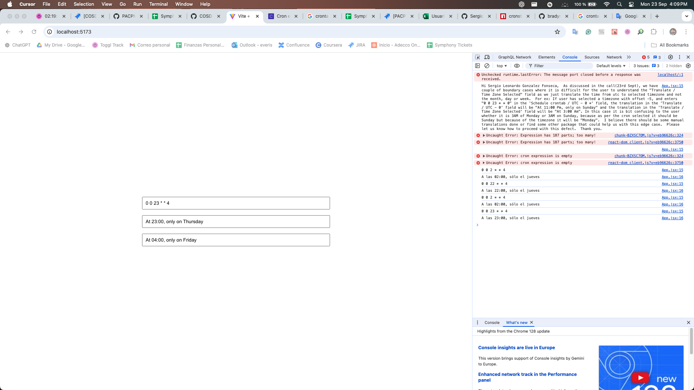
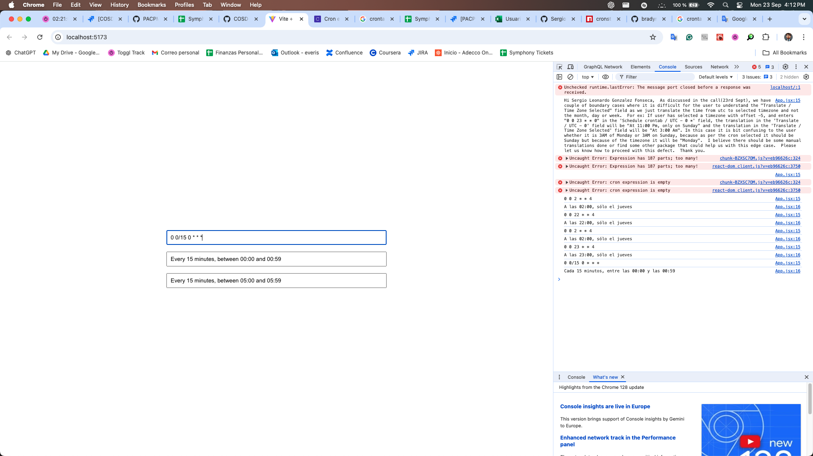
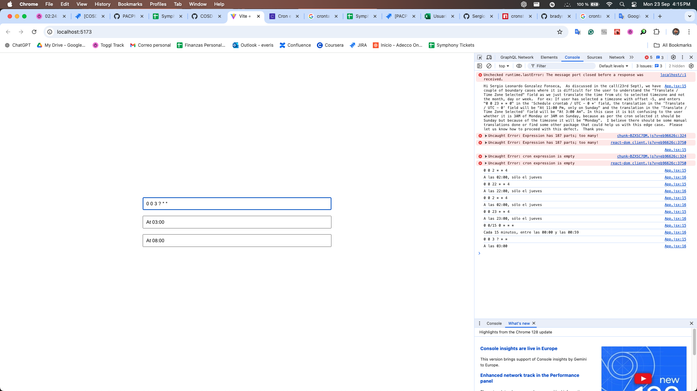
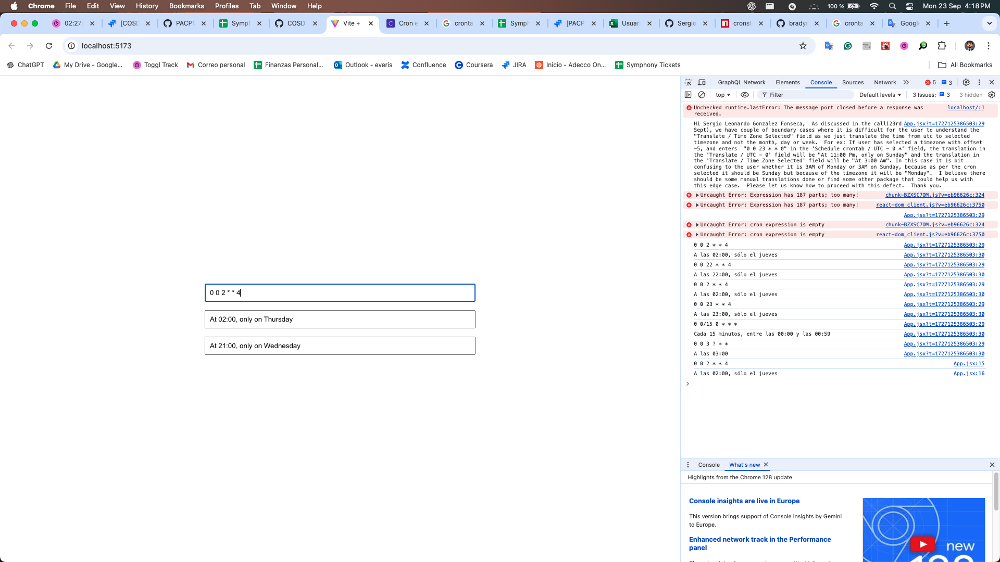
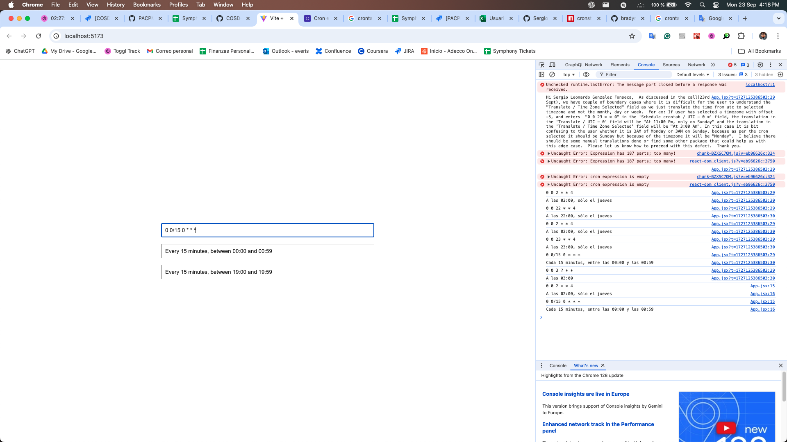
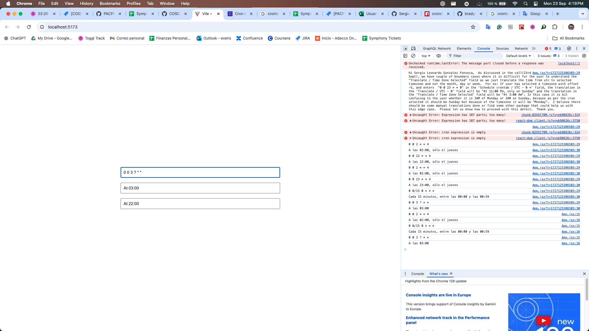

# Crontab library 

This repo is a simple example of how to use the `cronstrue` library to translate cron expressions to human-readable strings.

Next, some examples of border cases and how the library behaves:

NOTE: The examples have the `use24HourTimeFormat` option set to `true`, but works the same without it.

## (Timezone 5)

### 0 0 23 * * 4

### 0 0/15 0 * * *

### 0 0 3 ? * *

## (Timezone -5)

### 0 0 2 * * 4

### 0 0/15 0 * * *

### 0 0 3 ? * *

